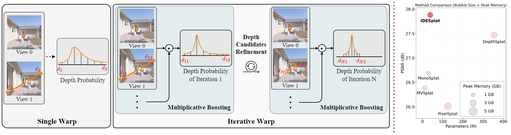
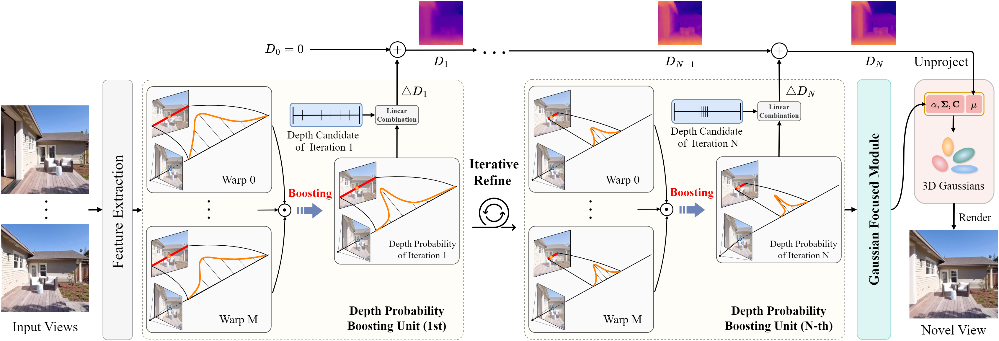

<p align="center">
  <h1 align="center">IDESplat: Iterative Depth Probability Estimation for Generalizable 3D Gaussian Splatting</h1>
  <p align="center">
    <a href="https://scholar.google.com/citations?user=CsVTBJoAAAAJ&hl=zh-CN">Wei Long</a>
    ·
    <a href="https://scholar.google.com/citations?user=rvVphXoAAAAJ&hl=zh-CN&oi=ao">Haifeng Wu</a>
    ·
    <a href="https://openreview.net/profile?id=~Shiyin_Jiang1">Shiyin Jiang</a>
    ·
    <a href="https://scholar.google.com/citations?user=tyYxiXoAAAAJ&hl=zh-CN">Jinhua Zhang</a>
    ·
    <a href="https://openreview.net/profile?id=~Xinchun_Ji2">Xinchun Ji</a>
    ·
    <a href="https://scholar.google.com/citations?user=-kSTt40AAAAJ&hl=zh-CN">Shuhang Gu</a>
  </p>

[//]: # (  <h3 align="center">CVPR 2025</h3>)

[//]: # (  <h3 align="center">)
[//]: # (  </h3>)
</p>

[](https://arxiv.org/abs/2601.03824)

<p align="left">
Generalizable 3D Gaussian Splatting aims to directly predict Gaussian parameters using a feed-forward network for scene reconstruction. Among these parameters, Gaussian means are particularly difficult to predict, so depth is usually estimated first and then unprojected to obtain the Gaussian sphere centers. Existing methods typically rely solely on a single warp to estimate depth probability, which hinders their ability to fully leverage cross-view geometric cues, resulting in unreliable and coarse depth maps. To address this limitation, we propose <strong>IDESplat, which iteratively applies warp operations to boost depth probability estimation for accurate Gaussian mean prediction.</strong> First, to eliminate the inherent instability of a single warp, we introduce a Depth Probability Boosting Unit (DPBU) that integrates epipolar attention maps produced by cascading warp operations in a multiplicative manner. Next, we construct an iterative depth estimation process by stacking multiple DPBUs, progressively identifying potential depth candidates with high likelihood. As IDESplat iteratively boosts depth probability estimates and updates the depth candidates, the depth map is gradually refined, resulting in accurate Gaussian means. We conduct experiments on RealEstate10K, ACID and DL3DV IDESplat achieves outstanding reconstruction quality and state-of-the-art performance with real-time efficiency. On RE10K, it outperforms DepthSplat by <strong>0.33 dB</strong> in PSNR, using only <strong>10.7%</strong> of the parameters and <strong>70%</strong> of the memory. Additionally, our IDESplat improves PSNR by <strong>2.95 dB</strong> over DepthSplat on the DTU dataset in cross-dataset experiments, demonstrating its strong generalization ability. 
</p>


<p align="center">
  <a href="">
    
  </a>
</p>


## Architecture

<p align="center">
  <a href="">
    
  </a>
</p>

The overall architecture of IDESplat. IDESplat is composed of three key parts: a feature extraction backbone, an iterative depth
probability estimation process, and a Gaussian Focused Module (GFM). The iterative process consists of cascaded Depth Probability
Boosting Units (DPBUs). Each unit combines multi-level warp results in a multiplicative manner to mitigate the inherent instability of a
single warp. As IDESplat iteratively updates the depth candidates and boosts the probability estimates, the depth map becomes more precise,
leading to accurate Gaussian means.


## Datasets

We mainly use RealEstate10K, ACID and DL3DV datasets for view synthesis experiments with Gaussian splatting. The datasets and processing methods follow the approach of [pixelsplat](https://github.com/dcharatan/pixelsplat
), [mvsplat](https://github.com/donydchen/mvsplat) and [depthsplat](https://github.com/cvg/depthsplat/tree/main).
The download links for the datasets can be found at:
[RealEstate10K and ACID](http://schadenfreude.csail.mit.edu:8000/), 
[DTU](https://drive.google.com/file/d/1eDjh-_bxKKnEuz5h-HXS7EDJn59clx6V/view), 
[DL3DV](https://huggingface.co/datasets/haofeixu/dl3dv-480p-chunks).

## Environment

```bash
# Step 1: Create and activate a new conda environment
conda create -y -n idesplat python=3.10
conda activate idesplat

# Step 2: Install CUDA Toolkit 12.4 (Recommended for local environment isolation)
conda install -c "nvidia/label/cuda-12.4.0" cuda-toolkit

# Step 3: Install PyTorch (Compute Platform: CUDA 12.4) and other dependencies
pip install torch==2.4.0 torchvision==0.19.0 --index-url https://download.pytorch.org/whl/cu124
pip install -r requirements.txt

# Step 4: Compile and install the custom SMM operators
cd ./ops_smm
./make.sh
```

## Pre-trained Models
We provide model weights trained on three datasets: RE10K, ACID, and DL3DV. These checkpoints are available on [Hugging Face](https://huggingface.co/hflonglong/IDESplat).

## Evaluation

```bash
# Evaluate on the RealEstate10K dataset
bash ./scripts/re10k_idesplat_evaluation.sh

# Evaluate on the ACID dataset
bash ./scripts/acid_idesplat_evaluation.sh


# Evaluate on DL3DV using 2 input views
bash ./scripts/dl3dv_idesplat_View2_evaluation.sh

# Evaluate on DL3DV using 4 input views
bash ./scripts/dl3dv_idesplat_View4_evaluation.sh

# Evaluate on DL3DV using 6 input views
bash ./scripts/dl3dv_idesplat_View6_evaluation.sh

# Model trained on RealEstate10K, zero-shot tested on ACID
bash ./scripts/re10k_for_acid_idesplat_evaluation.sh

# Model trained on RealEstate10K, zero-shot tested on DTU
bash ./scripts/re10k_for_dtu_idesplat_evaluation.sh
```

## Training


```bash
# Train on the RealEstate10K dataset
bash ./scripts/re10k_idesplat_train.sh

# Train on the ACID dataset
bash ./scripts/acid_idesplat_train.sh

# Train on the DL3DV dataset using 2 input views
bash ./scripts/dl3dv_idesplat_View2_train.sh

# Train on the DL3DV dataset using 4 input views
bash ./scripts/dl3dv_idesplat_View4_train.sh

# Train on the DL3DV dataset using 6 input views
bash ./scripts/dl3dv_idesplat_View6_train.sh
```

## Acknowledgements
This code is built on [pixelsplat](https://github.com/dcharatan/pixelsplat)
, [mvsplat](https://github.com/donydchen/mvsplat)
, [depthsplat](https://github.com/cvg/depthsplat/tree/main).
, [UniMatch](https://github.com/autonomousvision/unimatch)
, [Depth Anything V2](https://github.com/DepthAnything/Depth-Anything-V2)
 and [PFT](https://github.com/LabShuHangGU/PFT-SR). We sincerely thank the original authors for their outstanding contributions to the community.


## Citation

```
@article{long2026idesplat,
  title={IDESplat: Iterative Depth Probability Estimation for Generalizable 3D Gaussian Splatting},
  author={Long, Wei and Wu, Haifeng and Jiang, Shiyin and Zhang, Jinhua and Ji, Xinchun and Gu, Shuhang},
  journal={arXiv preprint arXiv:2601.03824},
  year={2026}
}
```
